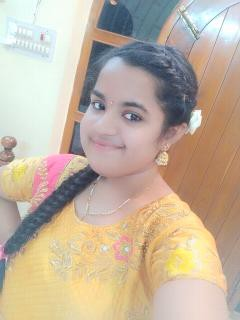

# sirishavidela
this is a code of resume
<html lang="en">

<head>
	<meta charset="UTF-8">
	<meta http-equiv="X-UA-Compatible" content="IE=edge">
	<meta name="viewport"
		content="width=device-width, initial-scale=1.0">
	<link rel="stylesheet" href="style.css">
</head>

<body>

	

		

			

				
			

			

				<h2>CONTACT</h2>
				

<b>Email id:</b>dora66@gmail.com

<b>Mobile no :</b>1234567890

			

			

				<h2>SKILLS</h2>
				

				<ul>
					<li><b><u>Programming Languages :</u></b>
					Python C  C++</li>
				</ul>
			

			

				<h2>LANGUAGES</h2>
				

				<ul>
					<li>English</li>
					<li>Hindi</li>
					<li>Telugu</li>
				</ul>
			

			

				<h2>HOBBIES</h2>
				

				<ul>
					<li>Reading Books</li>
					<li>Listening To Music</li>
					<li>Learning New Things</li>
					<li>Drawing</li>
				</ul>
			

		

		

			

				<h1>V.R.N.S.Sirisha</h1>
				

			

			 
			

				<h2>CAREER OBJECTIVE</h2>
				

				
To secure a challenging position in a reputable organization to expand my learnings, knowledge, and skills.

			

			 

			

				<h2>EDUCATION</h2>
				

				<table>
					<tr>
						<th><u>University/college</u> </th>
						<th><u>Passing year </u></th>
						<th><u>percentage/cgpa</u></th>
					</tr>
					<tr>
						<td>Vignan's Nirula</td>
						<td>2021</td>
						<td>Pursing</td>
					</tr>
					<tr>
						<td>Pragna Junior College</td>
						<td>2019-2021</td>
						<td>85%</td>
					</tr>
					<tr>
						<td>Kids Patasala English medium High School</td>
						<td>2018-2019</td>
						<td>9.5 GPA</td>
					</tr>
				</table>
			

			

				<h2>PROJECTS</h2>
				

				<ul>
					<li>
						<h2><u>Project-1 :</u></h2>
						

					
One Project is based on <b>C</b>-<i>Language</i>

					 
					</li>
					<li>
					<h2><u>Project-2 :</u></h2>
						
My Second project is based on <i>Python</i>

						 
					  <li><h2><u>Project-3 :</u></h2>
	 					
My Third project is based on <i>Html & CSS</i>

					</li>
				</ul>
			

		

	

</body>

</html>

this is the css code

<html lang="en">

<head>
	<meta charset="UTF-8">
	<meta http-equiv="X-UA-Compatible" content="IE=edge">
	<meta name="viewport"
		content="width=device-width, initial-scale=1.0">
	<link rel="stylesheet" href="style.css">
</head>

<body>

	

		

			

				
			

			

				<h2>CONTACT</h2>
				

<b>Email id:</b>dora66@gmail.com

<b>Mobile no :</b>1234567890

			

			

				<h2>SKILLS</h2>
				

				<ul>
					<li><b><u>Programming Languages :</u></b>
					Python C  C++</li>
				</ul>
			

			

				<h2>LANGUAGES</h2>
				

				<ul>
					<li>English</li>
					<li>Hindi</li>
					<li>Telugu</li>
				</ul>
			

			

				<h2>HOBBIES</h2>
				

				<ul>
					<li>Reading Books</li>
					<li>Listening To Music</li>
					<li>Learning New Things</li>
					<li>Drawing</li>
				</ul>
			

		

		

			

				<h1>V.R.N.S.Sirisha</h1>
				

			

			 
			

				<h2>CAREER OBJECTIVE</h2>
				

				
To secure a challenging position in a reputable organization to expand my learnings, knowledge, and skills.

			

			 

			

				<h2>EDUCATION</h2>
				

				<table>
					<tr>
						<th><u>University/college</u> </th>
						<th><u>Passing year </u></th>
						<th><u>percentage/cgpa</u></th>
					</tr>
					<tr>
						<td>Vignan's Nirula</td>
						<td>2021</td>
						<td>Pursing</td>
					</tr>
					<tr>
						<td>Pragna Junior College</td>
						<td>2019-2021</td>
						<td>85%</td>
					</tr>
					<tr>
						<td>Kids Patasala English medium High School</td>
						<td>2018-2019</td>
						<td>9.5 GPA</td>
					</tr>
				</table>
			

			

				<h2>PROJECTS</h2>
				

				<ul>
					<li>
						<h2><u>Project-1 :</u></h2>
						

					
One Project is based on <b>C</b>-<i>Language</i>

					 
					</li>
					<li>
					<h2><u>Project-2 :</u></h2>
						
My Second project is based on <i>Python</i>

						 
					  <li><h2><u>Project-3 :</u></h2>
	 					
My Third project is based on <i>Html & CSS</i>

					</li>
				</ul>
			

		

	

</body>

</html>
